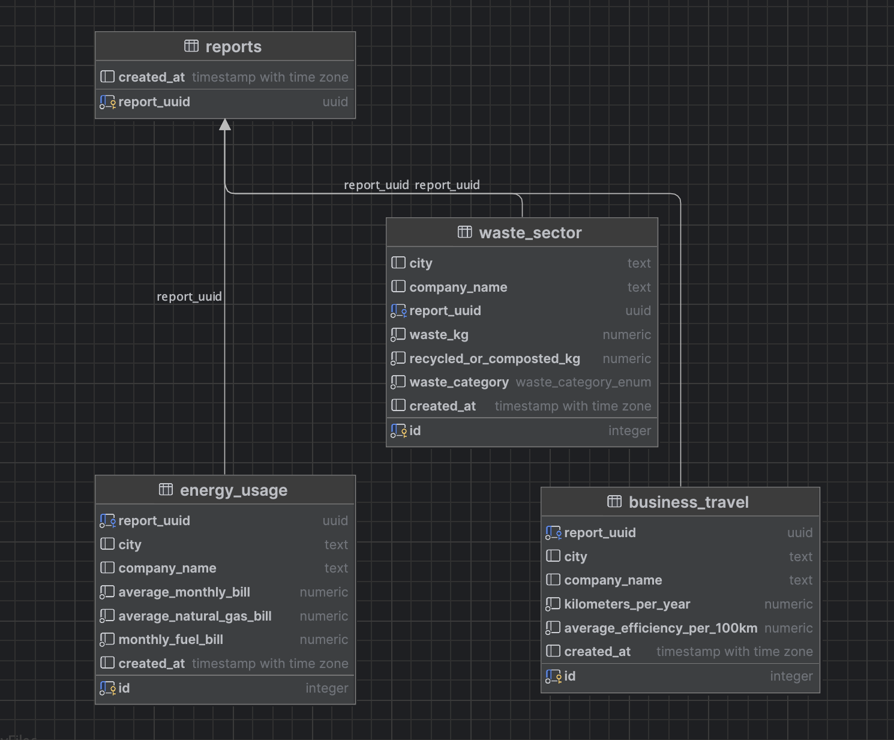

## CO2 Reduction Project 

This project is a pivotal component of the **M602A Computer Programming (WS0124)** course, aiming to provide a practical experience in programing.

### API Documentation

Explore my simple [API Documentation](http://64.226.89.177/api/doc#/) to get started with integrating your applications or conducting assessments.

### Project Overview

In an era where environmental sustainability is not just a choice but a necessity, the CO2 Reduction Project stands out by providing users with a simple analysis of their carbon footprint. Leveraging data and guidelines from the [European Environment Agency (EEA)](https://www.eea.europa.eu/), the project focuses on the environmental impacts of transportation, among other factors contributing to carbon emissions.

#### Features

- **Energy Consumption Analysis:** Assess the carbon footprint resulting from various energy sources.
- **Waste Production Evaluation:** Understand the impact of different waste production patterns.
- **Business Travel Insights:** Gain insights into how business travel contributes to overall carbon emissions.
- **Tailored Recommendations:** Receive personalized suggestions to reduce your carbon footprint based on your assessment results.

### Technologies Used

This project is built using cutting-edge technologies and frameworks to ensure high performance and scalability:

- **Python 3.11:** Chosen for its simplicity and vast ecosystem, Python 3.11 powers our backend logic and data processing, offering the latest features and optimizations for efficient programming.
- **aiohttp:** Utilized for its powerful asynchronous capabilities, aiohttp enables our project to handle a large number of simultaneous API requests without compromising performance.
- **aiohttp-swagger:** This integration provides a user-friendly interface for my API documentation, making it accessible and interactive for developers.
- **asyncpg:** A high-performance PostgreSQL database interface for Python/asyncio, asyncpg is used for its speed and efficiency in handling database operations.
- **psycopg2:** As a PostgreSQL adapter for Python, psycopg2 facilitates database connections and operations, ensuring reliable data storage and retrieval.
- **poetry:** This tool is used for dependency management and packaging in Python projects. It simplifies the management of project dependencies and ensures consistent environments across development and production setups.

### DB structure




### Project structure

```
├── app/
│   ├── __init__.py (Required for future use as a package directory)
│   ├── main.py (Main entry endpoint and API handlers)
│   ├── app.log (Retained for educational purposes)
│   ├── models/
│   │   ├── __init__.py
│   │   └── models.py (Contains the model classes with encapsulated logic)
│   ├── services/
│   │   ├── __init__.py
│   │   └── database.py (Connects to the Postgres DB)
│   ├── templates/
│   │   ├── __init__.py
│   │   └── constants.py (Contains constants)
├── tests/
│   ├── __init__.py
│   └── api-tests.py (API tests only; no unit tests currently)
├── .gitignore
├── pyproject.toml (Project information)
├── poetry.lock (System information for Poetry)
├── script_create_db.sh (Retained for educational purposes)
├── LICENSE (CC-BY-SA-4.0 license)
└── README.md
```

### Useful Links

- [API Documentation](http://64.226.89.177/api/doc#/)
- [EU Law on Emissions Monitoring & Reporting](https://eur-lex.europa.eu/legal-content/EN/TXT/?uri=CELEX:32013R0601)

### License

This project is licensed under the [Creative Commons Attribution-ShareAlike 4.0 International License (CC BY-SA 4.0)](https://creativecommons.org/licenses/by-sa/4.0/).
